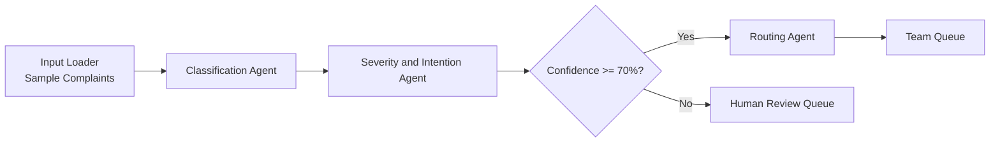

# Customer Complaint Classification and Routing Engine

Hackathon Challenge: AGENTS_004

## What This Project Does

This project processes customer complaints and routes them to the correct team using a modular agent pipeline.

MVP outcomes:

- Classify complaint category
- Assess severity and intention
- Apply confidence gate (human-in-the-loop if confidence < 70%)
- Route to destination team

## MVP Scope

In scope:

- Sample complaints as input (demo dataset)
- End-to-end notebook pipeline
- Structured outputs for easy extension

Out of scope (future):

- UI/dashboard
- Live ingestion from email/WhatsApp/social
- Jira/ServiceNow ticket creation

## Architecture (MVP)

Input Loader -> Classification Agent -> Severity and Intention Agent -> Confidence Gate -> Routing Agent

Confidence rule:

- If confidence >= 70%: auto-route
- If confidence < 70%: send to human review

## Categories and Team Routing

- Payments / Refund related -> Finance Team
- Baggage / Item lost -> Logistics Team
- Booking issues -> Reservations Team
- General inquiry -> Support Team
- Safety / Security concern -> Compliance Team
- Service quality -> Operations Team
- Other -> Support Team

## Tech Stack

- Python 3.11+
- Jupyter Notebook / JupyterLab
- AMD Developer Cloud (ROCm + vLLM image)
- Mistral 7B-class model served via vLLM
- Pydantic for output schema validation

## Quick Start

1. Open AMD notebook environment (ROCm + vLLM image).
2. Install project dependencies.
3. Start vLLM model server.
4. Run notebooks in sequence: setup -> agents -> pipeline -> metrics.

## Notes

- Designed for modular extension after MVP.
- Built for internal hackathon use.
