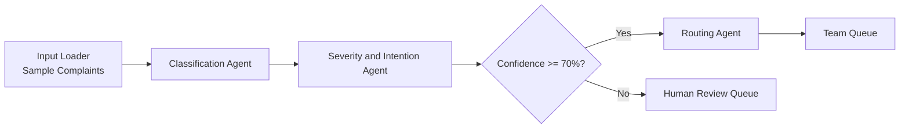

# Customer Complaint Classification and Routing Engine

Hackathon Challenge: AGENTS_004

## What This Project Does

This project processes customer complaints and routes them to the correct team using a modular agent pipeline.

MVP outcomes:

- Classify complaint category
- Assess severity and intention
- Apply confidence gate (human-in-the-loop if confidence < 70%)
- Route to destination team

## MVP Scope

In scope:

- Sample complaints as input (demo dataset)
- End-to-end notebook pipeline
- Structured outputs for easy extension

Out of scope (future):

- UI/dashboard
- Live ingestion from email/WhatsApp/social
- Jira/ServiceNow ticket creation

## Architecture (MVP)

Input Loader -> Classification Agent -> Severity and Intention Agent -> Confidence Gate -> Routing Agent



Confidence rule:

- If confidence >= 70%: auto-route
- If confidence < 70%: send to human review

## Categories and Team Routing

- Payments / Refund related -> Finance Team
- Baggage / Item lost -> Logistics Team
- Booking issues -> Reservations Team
- General inquiry -> Support Team
- Safety / Security concern -> Compliance Team
- Service quality -> Operations Team
- Other -> Support Team

## Tech Stack

- Python 3.11+
- Jupyter Notebook / JupyterLab
- AMD Developer Cloud (ROCm + vLLM image)
- Mistral 7B-class model served via vLLM
- Pydantic for output schema validation

## Project Layout

```
src/complaint_router/    # core package (schemas, config, agents, pipeline, guardrails)
  agents/                # one module per specialized agent (Stages 1-4)
  llm/                   # pluggable client: mock backend + vLLM backend
data/                    # labeled sample complaints
notebooks/               # thin demo notebooks (01 cloud-only, 02-04 run locally)
tests/                   # pytest suite (gate, routing, schemas, guardrails, pipeline)
```

## Run Locally (mock backend, no GPU)

The pipeline runs end-to-end on a deterministic mock LLM backend, so you can
develop and test on any machine before moving to the AMD cloud.

```bash
python -m venv .venv
.venv/Scripts/python -m pip install -e ".[dev]"   # Windows; use .venv/bin/python on Unix
.venv/Scripts/python -m pytest                    # run the test suite
```

Then open `notebooks/02`, `03`, and `04` and run them top to bottom — they
import the package and use `MockClient`.

## Switch to vLLM on the AMD Cloud

1. Open the AMD notebook environment (ROCm + vLLM image) and run `notebooks/01`
   to verify the GPU and start the vLLM server (model id is pinned in
   `complaint_router.config`).
2. In notebooks 03/04, swap the backend — no other code changes:
   ```python
   from complaint_router.llm.vllm_client import VLLMClient
   client = VLLMClient()
   ```
   Outputs validate against the same Pydantic schemas as the mock.

## Confidence Gate and Escalation Override

- `final_confidence = min(category_confidence, analysis_confidence)`
- Auto-route requires `final_confidence >= 0.70` **and** intention is not
  `Escalation` **and** severity is not `High`. Otherwise the complaint goes to
  the human-review queue (high-stakes cases never auto-route silently).

## Notes

- Designed for modular extension after MVP.
- Built for internal hackathon use.
